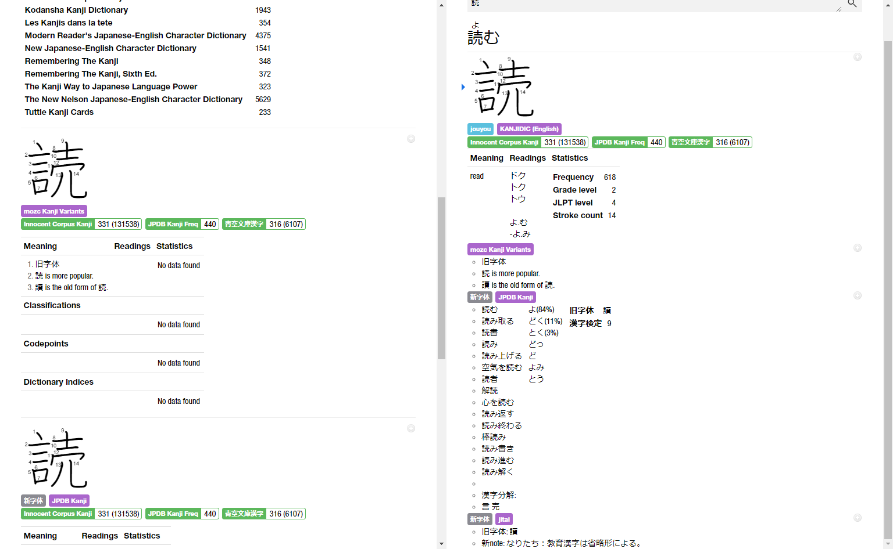

# Yomichan Dictionaries <!-- omit in toc -->

### Check out my [JP Resources](https://github.com/MarvNC/JP-Resources)

### [Changelog](https://github.com/MarvNC/yomichan-dictionaries/commits/master/dl)

- [Japanese](#japanese)
  - [Terms](#terms)
    - [Term Dictionary](#term-dictionary)
      - [niconico-pixiv Terms](#niconico-pixiv-terms)
      - [複合語起源](#複合語起源)
    - [Term Frequency](#term-frequency)
      - [jpdb Frequency Dictionary](#jpdb-frequency-dictionary)
      - [Aozora Bunko Jukugo Frequency](#aozora-bunko-jukugo-frequency)
  - [Kanji](#kanji)
    - [Yomichan CSS for Kanji Dictionaries](#yomichan-css-for-kanji-dictionaries)
    - [Kanji Info](#kanji-info)
      - [Wiktionary Kanji](#wiktionary-kanji)
      - [jpdb Kanji](#jpdb-kanji)
    - [Kanji Variants](#kanji-variants)
      - [mozc](#mozc)
      - [jitai](#jitai)
    - [Kanji Frequency](#kanji-frequency)
      - [Aozora Bunko Kanji Frequency](#aozora-bunko-kanji-frequency)
      - [Innocent Corpus Kanji Frequency](#innocent-corpus-kanji-frequency)
      - [Wikipedia Kanji Frequency](#wikipedia-kanji-frequency)
      - [jpdb Kanji Frequency](#jpdb-kanji-frequency)
- [Chinese](#chinese)
  - [Hanzi](#hanzi)
    - [Wiktionary Hanzi](#wiktionary-hanzi)

# Japanese

## Terms

### Term Dictionary

#### niconico-pixiv Terms

**[Download](https://github.com/MarvNC/yomichan-dictionaries/raw/master/dl/%5BOther%5D%20Nico-Pixiv.zip)**

Using the information [gathered by ncaq for use in an IME](https://github.com/ncaq/dic-nico-intersection-pixiv), this is a dictionary that can help parse terms that are in **both** [niconico](https://dic.nicovideo.jp/) and [pixiv](https://dic.pixiv.net/)'s online dictionaries. These online dictionaries are sort of like encyclopedias of the internet, so many terms such as proper nouns not in traditional dictionaries will be found.

> ルールベースで IME 辞書の役に立たなそうな単語を除外しています。

%E3%81%A8%E3%81%AF%E3%80%90%E3%83%94%E3%82%AF%E3%82%B7%E3%83%96%E7%99%BE%E7%A7%91%E4%BA%8B%E5%85%B8%E3%80%91_-_httpsdic.pixiv.net_2022-08-21_17-22-10.png>)

#### 複合語起源

**[Download](https://github.com/MarvNC/yomichan-dictionaries/raw/master/dl/%5BOther%5D%20%E8%A4%87%E5%90%88%E8%AA%9E%E8%B5%B7%E6%BA%90.zip)** | **[List of words](termOrigins/%E8%A4%87%E5%90%88%E8%AA%9E%E8%B5%B7%E6%BA%90.tsv)**

Compound kunyomi word origins, for example 陥る -> 落ち入る（おち|いる）. Information comes from anonymous forum posts, so it may not be 100% accurate.


**Sources:**

- [shitaraba](https://jbbs.shitaraba.net/bbs/read.cgi/study/10958/1299762655/)
- [5ch](https://academy6.5ch.net/test/read.cgi/gengo/1228873581/)
- [Wanikani](https://community.wanikani.com/t/special-kanji-words-derived-from-other-words/35655)

### Term Frequency

#### jpdb Frequency Dictionary

**[Download](https://github.com/MarvNC/jpdb-freq-list/releases)**

A frequency dictionary based on information from https://jpdb.io. More information can be found [here](https://github.com/MarvNC/jpdb-freq-list).

#### Aozora Bunko Jukugo Frequency

**[Download](https://github.com/MarvNC/yomichan-dictionaries/raw/master/dl/%5BFreq%5D%20Aozora%20Bunko.zip)**

A frequency dictionary created using data [collected by vrtm](https://vtrm.net/japanese/kanji-jukugo-frequency/en) based on the [Aozora Bunko](https://www.aozora.gr.jp/). Due to the [methodology used](https://vtrm.net/japanese/kanji-jukugo-frequency/en), this dictionary does not cover words with kana in them but it covers many rare 熟語 not covered by other frequency dictionaries, such as 睽乖.

## Kanji

### Yomichan CSS for Kanji Dictionaries

Yomichan and KANJIDIC by default have a lot of bloat in the kanji dictionary viewer, like repeating the kanji stroke order image, frequency information, and unused table rows for every entry. For using multiple kanji dictionaries, you can use some CSS to make the kanji display more compact like it is for terms.



In `Settings -> Popup Appearance -> Configure custom CSS...` input the following CSS for more compact display of entries.

```css
/* remove misc dict classifications/codepoints/stats */
.kanji-glyph-data > tbody > tr:nth-child(n + 3) {
  display: none;
}

/* remove stroke diagram, freq, header for next entries */
div.entry[data-type='kanji']:nth-child(n + 2) .kanji-glyph-container,
div.entry[data-type='kanji']:nth-child(n + 2) [data-section-type='frequencies'],
div.entry[data-type='kanji']:nth-child(n + 2) table.kanji-glyph-data > tbody > tr:first-child {
  display: none;
}

/* remove 'No data found' */
.kanji-info-table-item-value-empty {
  display: none;
}

/* reduce extra padding */
.kanji-glyph-data,
div.entry[data-type='kanji'],
div.entry[data-type='kanji']:nth-child(n + 2) .kanji-glyph-data > tbody > tr > *,
.kanji-glyph-data dl.kanji-readings-japanese,
div.entry[data-type='kanji']:nth-child(n + 2)
  .kanji-glyph-data
  dl.kanji-readings-chinese[data-count='0'] {
  padding-top: 0 !important;
  padding-bottom: 0 !important;
  margin-bottom: 0em;
  margin-top: 0 !important;
}
/* remove horizontal lines */
.entry + .entry[data-type='kanji'],
div#dictionary-entries > div.entry:nth-child(n + 2) .kanji-glyph-data > tbody > tr > * {
  border-top: none !important;
}
/* change decimal list */
.kanji-gloss-list {
  list-style-type: circle;
}
```

### Kanji Info

#### Wiktionary Kanji

**[Download](https://github.com/MarvNC/yomichan-dictionaries/raw/master/dl/%5BKanji%5D%20Wiktionary.zip)**

Kanji information of around 18,000 characters from [Wiktionary](https://ja.wiktionary.org/), notably:

- 呉音, 漢音, 唐音, 宋音, 慣用音 onyomi readings of kanji ([further reading](<https://en.wikipedia.org/wiki/Kanji#On'yomi_(Sino-Japanese_reading)>))
- 字源 - information about how and why a kanji is composed the way it is, including the [type of composition it is](https://en.wikipedia.org/wiki/Kanji#Types_of_kanji_by_category)
- The meaning of the kanji (in Japanese)
- The various 異体字 of the kanji


#### jpdb Kanji

**[Download](https://github.com/MarvNC/yomichan-dictionaries/raw/master/dl/%5BKanji%5D%20JPDB%20Kanji.zip)**

Kanji information of around 6,000 characters from https://jpdb.io:

- The 15 most common vocab applicable
- The kanji decomposition according to jpdb (has inaccuracies because it's meant for memorizing keywords)
- 漢字検定 level
- 旧字体/新字体/拡張新字体 character form


<!-- ### The Kanji Map

A kanji dictionary created using the data from [The Kanji Map](https://github.com/gabor-kovacs/the-kanji-map) providing radical information and kanji decompositions. -->

### Kanji Variants

#### mozc

**[Download](https://github.com/MarvNC/yomichan-dictionaries/raw/master/dl/%5BKanji%5D%20mozc%20Kanji%20Variants.zip)**

A kanji dictionary made from the kanji variant information in [Google's mozc Japanese IME](https://github.com/google/mozc). Includes information about:

- 異体字
- 印刷標準字体
- 簡易慣用字体
- 旧字体
- 略字
- 正字
- 俗字
- 別字
- 本字


#### jitai

**[Download](https://github.com/MarvNC/yomichan-dictionaries/raw/master/dl/%5BKanji%5D%20jitai.zip)**

A kanji dictionary made using the data from [jitai](https://github.com/epistularum/jitai). This allows you to see information about 旧字体, 新字体, 拡張新字体, and 標準字体 variants from the kanji page in Yomichan.


### Kanji Frequency

#### Aozora Bunko Kanji Frequency

**[Download](https://github.com/MarvNC/yomichan-dictionaries/raw/master/dl/%5BKanji%20Frequency%5D%20Aozora%20Bunko.zip)**

A kanji frequency dictionary created using data [collected by vrtm](https://vtrm.net/japanese/kanji-frequency/en) based on the [Aozora Bunko](https://www.aozora.gr.jp/).

#### Innocent Corpus Kanji Frequency

**[Download](https://github.com/MarvNC/yomichan-dictionaries/raw/master/dl/%5BKanji%20Frequency%5D%20Innocent%20Corpus%20Kanji.zip)**

Uses the [innocent corpus frequency list](https://web.archive.org/web/20190309073023/https://forum.koohii.com/thread-9459.html#pid168613) that is distributed with [Yomichan](https://github.com/FooSoft/yomichan#dictionaries) to create a rank-based kanji frequency dictionary. This was created because the existing one is an occurence-based list and does not display ranks.

- The displayed frequency in Yomichan will contain the frequency rank followed by the occurence count, for example `4686 (57)` for 壟 indicating it's the 4686th most common kanji and appeared 57 times total in the 5000+ novels in Innocent Corpus.

#### Wikipedia Kanji Frequency

**[Download](https://github.com/MarvNC/yomichan-dictionaries/raw/master/dl/%5BKanji%20Frequency%5D%20Wikipedia.zip)**

Rank-based kanji frequency data from a May 2015 dump of Japanese Wikipedia, containing around 2 万 kanji. Data [gathered by scriptin](https://github.com/scriptin/kanji-frequency).

#### jpdb Kanji Frequency

**[Download](https://github.com/MarvNC/yomichan-dictionaries/raw/master/dl/%5BKanji%20Frequency%5D%20JPDB%20Kanji.zip)**

Kanji frequency data from https://jpdb.io.

# Chinese

## Hanzi

### Wiktionary Hanzi
